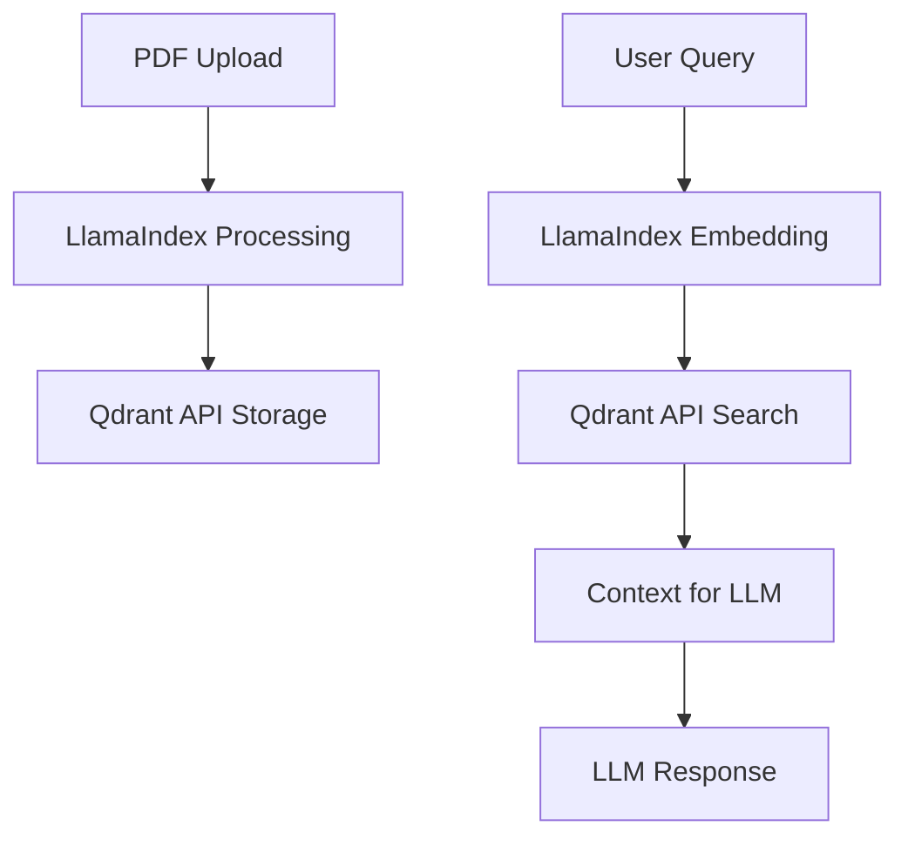

# Comparison: `app.py` vs `app_qdrant_api.py`

This document explains the differences between the original `app.py` (LlamaIndex in-memory) and the new `app_qdrant_api.py` (LlamaIndex + Qdrant API) for future reference.

---

## 1. Architecture Overview

| Aspect                | `app.py` (Original)         | `app_qdrant_api.py` (New)         |
|----------------------|-----------------------------|-----------------------------------|
| **Vector Storage**   | LlamaIndex in-memory        | Qdrant database (via REST API)    |
| **Persistence**      | Lost on restart             | Permanent storage                 |
| **Embeddings**       | BAAI/bge-large-en-v1.5      | BAAI/bge-large-en-v1.5            |
| **Processing**       | LlamaIndex pipeline         | LlamaIndex + Qdrant API           |
| **Services**         | None                        | Qdrant Docker container           |

---

## 2. Data Flow

### `app.py` (Original)
```
PDF Upload → LlamaIndex Processing → In-Memory Storage → Direct Query → Response
```

### `app_qdrant_api.py` (New)
```
PDF Upload → LlamaIndex Processing → Qdrant API Storage → Qdrant API Search → Context → LLM → Response
```

---

## 3. Key Code Differences

### A. Qdrant API Integration (New)
- Uses Python `requests` to interact with Qdrant's REST API for all vector storage, search, and collection management.
- No custom FastAPI service or processor needed.

### B. PDF Processing
- **Both** use LlamaIndex's `SimpleDirectoryReader` to load and chunk PDFs.
- **Both** use the same embedding model: `BAAI/bge-large-en-v1.5`.
- **New**: Instead of storing vectors in memory, the new version uploads them to Qdrant via API.

### C. Search
- **Original**: Queries LlamaIndex's in-memory index.
- **New**: Embeds the query with LlamaIndex, then searches Qdrant via API for similar vectors, and uses the results as context for the LLM.

### D. Document Management
- **New**: Can list, delete, and manage documents/collections in Qdrant via API.
- **Original**: No document management; everything is lost on restart.

### E. Health Monitoring
- **New**: Checks if Qdrant is running before allowing uploads or searches.

---

## 4. Example Code Snippets

### Create Collection (New)
```python
response = requests.put(
    f"{QDRANT_API_URL}/collections/{collection_name}",
    json=collection_config
)
```

### Upload Vectors (New)
```python
response = requests.put(
    f"{QDRANT_API_URL}/collections/{collection_name}/points",
    json={"points": points}
)
```

### Search Vectors (New)
```python
response = requests.post(
    f"{QDRANT_API_URL}/collections/{collection}/points/search",
    json=search_payload
)
```

---

## 5. Benefits of the New Approach

- **Persistence**: Data is not lost on restart.
- **Scalability**: Can handle thousands of documents.
- **Production Ready**: Uses Qdrant, a dedicated vector database.
- **Document Management**: Upload, delete, and list documents.
- **No Custom Processor Needed**: Simpler architecture.
- **Same Embedding Quality**: Still uses LlamaIndex's best models.

---

## 6. When to Use Each

- **Use `app.py`** if you want a quick, in-memory prototype and don't care about persistence.
- **Use `app_qdrant_api.py`** if you want scalable, persistent, production-ready document search with LlamaIndex embeddings and Qdrant storage.

---

## 7. Setup for `app_qdrant_api.py`

1. **Start Qdrant**:
   ```bash
   docker run -d -p 6333:6333 qdrant/qdrant:latest
   ```
2. **Install dependencies**:
   ```bash
   pip install -r requirements.qdrant_api.txt
   ```
3. **Run the app**:
   ```bash
   streamlit run app_qdrant_api.py
   ```

---

## 8. Summary Table

| Feature                | `app.py`         | `app_qdrant_api.py` |
|------------------------|------------------|---------------------|
| Embedding Model        | BAAI/bge-large   | BAAI/bge-large      |
| Storage                | In-memory        | Qdrant DB           |
| Persistence            | No               | Yes                 |
| Document Management    | No               | Yes                 |
| Health Monitoring      | No               | Yes                 |
| Scalability            | Limited          | High                |
| API Usage              | No               | Yes (Qdrant REST)   |

---

## 9. Visual Summary



---

## 10. Conclusion

- The new approach (`app_qdrant_api.py`) is more robust, scalable, and production-ready.
- It leverages the best of LlamaIndex (embeddings, chunking) and Qdrant (vector search, persistence).
- No custom FastAPI processor is needed—just Qdrant and your Streamlit app. 